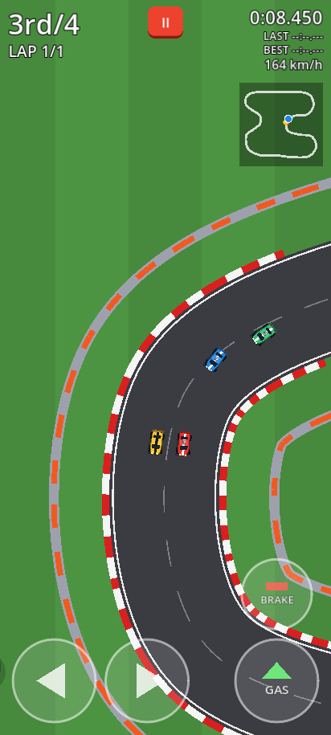
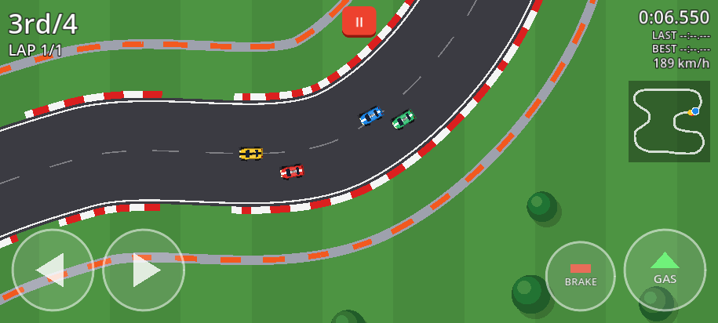

# Topdown Racer (v0.1)

### ▶ [Play now in your browser](https://tomokifaizuru.github.io/topdown-racer/)

Works on phones (portrait or landscape, multi-touch) and desktop browsers.
Tip: add `?demo` to the URL to watch the AI drive your car (`?demo&laps=1` for a quick race).




A top-down 2D arcade racing prototype made with **Godot 4.5.1** (GL Compatibility renderer).
One closed-loop track, you vs. 3 AI cars, 3 laps. All art and sounds are original and
generated in code (Godot shapes + procedural WAVs), no third-party assets.

## Features (v0.1)
- Arcade car physics: acceleration, braking / reverse, speed-scaled steering, sideways grip,
  drifting (brake + steer at speed, or Space) with skid marks and tyre squeal.
- Asphalt with red/white curbs on corners, grass run-off that slows you down, tyre-barrier walls.
- Start/finish line + 10 checkpoints (must be passed in order, so no shortcuts), wrong-way warning.
- 3 AI cars following the track's racing line (Path2D) with per-car speed, random variation
  per race, corner slowdown, "avoidance-lite" around cars ahead and stuck recovery.
- Title screen, 3-2-1-GO countdown, lap counter, current / last / best lap timer, live
  position (1st-4th), speedometer, minimap, pause menu, results screen with Restart / Menu.
- Fixed-north camera with smoothing, look-ahead and slight zoom-out at speed
  (a rotating camera is one checkbox away, see below).

## Controls
| Action | Keyboard | Touch (phone) | Gamepad |
|---|---|---|---|
| Accelerate | Up / W | **GAS** (bottom right) | A / Cross, RT |
| Brake / reverse | Down / S | **BRAKE** (above GAS in portrait, left of GAS in landscape) | X / Square, LT |
| Steer | Left/Right, A/D | ◀ ▶ buttons (bottom left, slide your thumb between them) | Left stick, D-pad |
| Handbrake (drift) | Space | brake while steering at speed | B / Circle |
| Pause | Esc / P | **II** button (top) | Start |

Drift: at speed, hold brake while steering to break traction, then release brake and accelerate.

## Open it in the Godot editor (Windows)
1. Install **Godot 4.5.1 stable** (standard version, not .NET) from https://godotengine.org/download/archive/4.5.1-stable/
2. Download this repo (green **Code** button > Download ZIP, or `git clone`) and unzip it.
3. Start Godot > **Import** > pick the `project.godot` file in the folder > **Import & Edit**.
4. Press **F5** (or the ▶ button) to play. `scenes/title.tscn` is the main scene; open
   `scenes/race.tscn` and press **F6** to jump straight into a race.

## Tweaking values (Inspector)
Everything below is an `@export` variable with a tooltip comment. Select the node and edit it in
the Inspector; changes on a node inside `race.tscn` apply only to that car, changes in
`car.tscn` apply to all cars that don't override the value.

| Where (scene > node) | Script | What you can tune |
|---|---|---|
| `race.tscn` > **Race** (root) | `scripts/race.gd` | `lap_count`, `countdown_seconds`, `player_grid_slot`, `ai_difficulty` (global AI speed multiplier), `ai_speed_variation` (random ± per race), `demo_mode` |
| `race.tscn` > Cars > **Player** / **CPU1-3** (or `car.tscn` for all) | `scripts/car.gd` | **Driver & Look:** `driver` (PLAYER/AI), `car_name`, `body_color`, `stripe_color`, `car_number`<br>**Engine & Brakes:** `max_speed`, `acceleration`, `brake_force`, `reverse_max_speed`, `reverse_acceleration`, `coast_drag`<br>**Steering:** `steer_speed_deg`, `steer_full_speed`, `high_speed_steer_factor`, `steer_smoothing`<br>**Grip & Drift:** `grip`, `drift_grip`, `drift_min_speed`, `drift_brake_factor`, `drift_steer_boost`, `slide_speed_loss`, `skid_threshold`<br>**Surface & Collisions:** `offroad_max_speed_factor`, `offroad_drag`, `offroad_grip_factor`, `wall_bounce`, `wall_speed_keep`<br>**AI:** `ai_speed_factor`, `ai_lookahead`, `ai_lookahead_per_speed`, `ai_lane_offset`, `ai_steer_gain`, `ai_corner_slowdown`, `ai_corner_angle_deg`, `ai_avoid_distance`, `ai_avoid_strength` |
| `race.tscn` > **Camera** | `scripts/race_camera.gd` | `look_ahead_time`, `max_look_ahead`, `follow_smoothing`, `base_zoom`, `speed_zoom_out`, `rotate_with_car`, `rotation_smoothing` |
| `track.tscn` > **Track** | `scripts/track.gd` | `road_width`, `grass_width`, `curb_width`, `curb_max_radius`, `wall_thickness`, `checkpoint_count`, `show_checkpoints`, grid spacing, all track colours, `tree_count` |
| `track.tscn` > Track > **RacingLine** (Path2D) | - | Drag the curve points to reshape the track (live preview in the editor). The AI follows this line; point 0 is the start/finish. Keep separate parts of the track ~700 px apart. |
| `race.tscn` > **TouchControls** | `scripts/touch_controls.gd` | `show_mode` (AUTO / ALWAYS / NEVER), `button_radius`, `brake_scale`, `edge_margin`, `button_gap`, `opacity` |
| `race.tscn` > SkidMarks | `scripts/skid_marks.gd` | `max_segments`, `mark_color`, `mark_width` |
| `hud.tscn` > Root > Minimap | `scripts/minimap.gd` | colours, line width, dot size |

Units are pixels and seconds; about 12 px = 1 m (820 px/s ≈ 246 km/h on the HUD).

## Web export
The live build in `docs/` is served by GitHub Pages (main branch, `/docs` folder).
It uses the **single-threaded** web template (no SharedArrayBuffer / COOP-COEP headers needed).
To rebuild: install the 4.5.1 export templates, then **Project > Export > Web > Export Project**
to `docs/index.html` (the preset is already in `export_presets.cfg`), or headless:
```
godot --headless --path . --export-release "Web" docs/index.html
```

## Project layout
```
project.godot, export_presets.cfg, icon.svg
scenes/   title, race, track, car, hud, touch_controls
scripts/  gameplay scripts (one per scene/node type)
ui/       theme.tres (buttons/panels/labels)
audio/    procedural SFX (engine loop, skid loop, beeps, bump)
tools/    track_design.py (curve generator/checker), make_sfx.py, sim_test.gd (headless AI race test)
docs/     exported web build (GitHub Pages)
```
