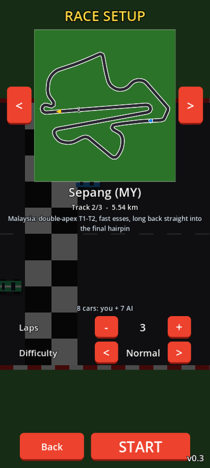
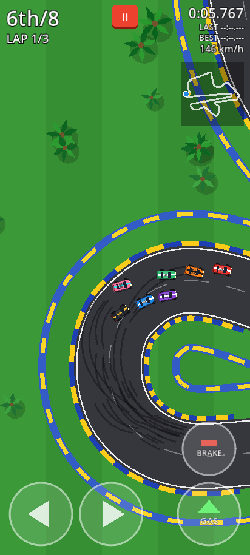
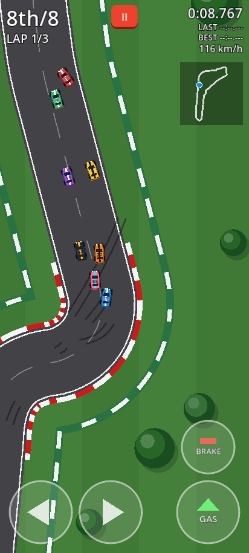
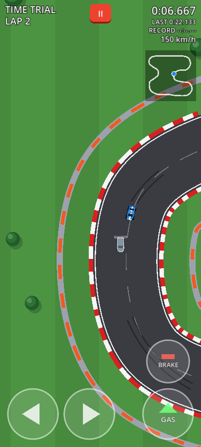
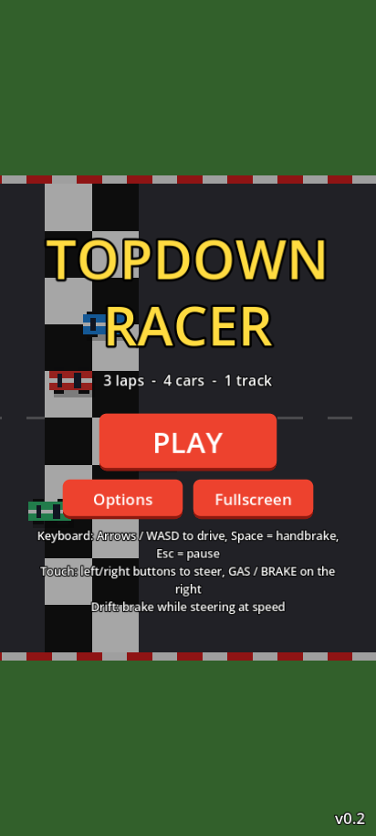
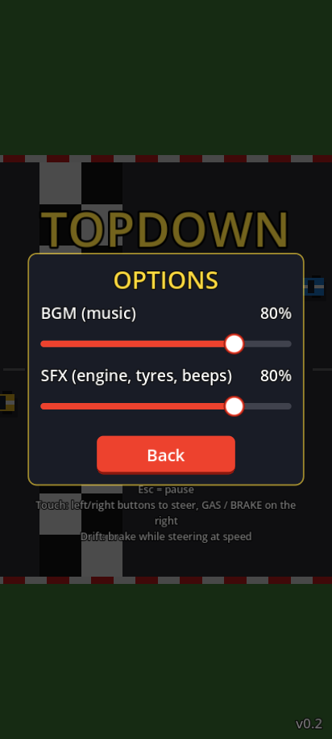

# Topdown Racer (v0.3)

### ▶ [Play now in your browser](https://tomokifaizuru.github.io/topdown-racer/)

Works on phones (portrait or landscape, multi-touch) and desktop browsers.
Tip: add `?demo` to the URL to watch the AI drive your car (`?demo&laps=1` for a quick race,
`?demo&track=monza&diff=3` for Monza on WTF?!, `?demo&mode=tt&track=sepang` for a Time Trial demo).









A top-down 2D arcade racing prototype made with **Godot 4.5.1** (GL Compatibility renderer).
Three tracks, Race mode (you vs. 7 AI cars, 3-8 laps, 4 difficulties) and a Time Trial with a
ghost of your best lap. All art and sound effects are original and
generated in code (Godot shapes + procedural WAVs); the menu music is an original track by DJ.
No third-party assets (the two real-world circuit shapes are traced from MIT-licensed outline
data, see *Credits*).

## What's new in v0.3
- **Menu flow:** Title → **Mode** (Race / Time Trial) → **Setup** → START. The setup page shows the
  track outline (with a dot lapping it), name, length and a short description, plus
  **Laps** (3-8, default 3) and **Difficulty** in Race mode, or **Ghost car** / **Online ranking** /
  **Your name** / your best lap / the online top 5 in Time Trial. Everything is saved. Portrait and
  landscape layouts (side by side in landscape).
- **3 tracks** (`scenes/tracks/`), each with its own RacingLine Path2D, checkpoints, 8-slot grid,
  trees, grandstand, minimap and colour theme:
  | Track | Inspired by | Length (menu) | Theme |
  |---|---|---|---|
  | **Rookie Ring** | original v0.1 circuit | 1.32 km | classic green, red/white curbs |
  | **Sepang (MY)** | Sepang International Circuit, Malaysia | 5.54 km | tropical: palms, yellow/blue curbs, blue walls |
  | **Monza (IT)** | Autodromo Nazionale Monza, Italy | 5.79 km | parkland: dense trees, green/white walls |

  Sepang and Monza are traced from real centre-line coordinates (scaled 7 px = 1 m, corners
  tighter than ~20 m radius smoothed): Sepang has the double-apex T1-T2, the fast esses, the long back
  straight into the final hairpin and the main straight; Monza has the long main straight,
  Rettifilo chicane, Curva Grande, Roggia chicane, both Lesmos, the Serraglio straight, Ascari and
  the Parabolica. A lap takes about 55 s.
- **8 cars** in Race mode: you (#7 blue) + Blaze #3, Bolt #5, Frost #9, Viper #11, Nova #22,
  Onyx #44, Coral #88. The results table shows all 8.
- **Difficulty** (Easy / Normal / Hard / **WTF?!**), stored as editable resources in `difficulty/*.tres`:
  | | Easy | Normal | Hard | WTF?! |
  |---|---|---|---|---|
  | AI top speed (× your car's) | 0.82 | 0.92 | 1.00 | 1.08 |
  | Corner margin (share of steering used in bends) | 0.70 | 0.80 | 0.85 | 0.95 |
  | Acceleration × | 0.85 | 1.00 | 1.00 | 1.20 |
  | Steering × | 1.00 | 1.00 | 1.00 | 1.25 |
  | Grip × | 1.00 | 1.00 | 1.05 | 1.30 |
  | Racing line (apex cut) | 0 | 0.3 | 0.5 | 0.7 |
  | Avoidance × (lower = more aggressive) | 1.2 | 1.0 | 0.9 | 0.7 |
  | Rubber-band: AI far ahead slow down up to | 8% | 4% | 3% | 0 |
  | Rubber-band: AI far behind speed up up to | 0 | 2% | 3% | 6% |

  Each AI car also has its own `ai_speed_factor` (1.00 Blaze … 0.94 Coral) and ±3% random variation per race.
- **Smarter AI:** the new default corner model reads the track curvature ahead and brakes just
  enough for every bend in braking range (`ai_corner_model = CURVATURE`; the v0.2 heuristic is still
  available as `SIMPLE`). Headless tests: full 3-lap races with 8 cars on every track × difficulty,
  every car finishes, no car gets stuck or needs a respawn.
- **Time Trial:** just you, unlimited flying laps (you start 700 px before the line). Lap timer, last
  lap, all-time **record per track** (saved), delta to your record after every lap.
  **Ghost car:** your best lap on each track is recorded (20 samples/s of position + rotation,
  ~13 KB per lap) to `user://ghost_<track>.dat` and replayed as a semi-transparent car (also a
  white dot on the minimap). Toggle it with **Ghost car** in the setup.
- **Global best-lap ranking (Time Trial, optional, off by default):** see below.
- Faster track drawing: the track is split into small chunks so off-screen parts aren't drawn
  (important for the 40 000 px real circuits on phones).

### Online ranking (Time Trial)
- Uses the open-source **HighScore API** at `https://api-leaderboard.qulyubis.biz.id`
  (the same service as Slime Barrage; docs at `/docs`, source github.com/Resaqulyubi/api-highscore-leaderboard).
  One board per track: game id **22** Rookie Ring, **23** Sepang (MY), **24** Monza (IT)
  (`scripts/online_leaderboard.gd`). The API has no delete endpoint, so these boards are permanent.
- The API ranks the **highest** score first and keeps each player's best score, so a lap is sent as
  **score = 10 000 000 − lap time in ms** (1:02.345 → 9 937 655); the game converts it back for display.
- Only real new personal records are sent (Time Trial, not autopilot/demo, lap time above a
  physically possible minimum), only when **Online ranking** is ON and a name is set. Names may use
  letters, numbers, spaces, `- _ . @` (max 20 characters).
- Each score carries a small `game_metadata` (`lap_ms`, `track`, `version`). The API stores metadata
  but never returns it in the leaderboard, so ghosts can't be shared through it (yet).
- The API keys are inside the web build (like any browser game), so treat the ranking as "for fun".

## What's new in v0.2
- **Menu music:** original title-screen BGM *"Pole Position Sunshine"* by **DJ** (135 BPM, D major,
  64.000 s seamless loop; see `audio/music/NOTES.md`). It keeps playing in the menus and fades out when the race starts.
  Browsers block sound until you interact with the page, so on the web the music starts on your
  first tap / click / key press (a small "Tap anywhere to turn on the music" hint shows until then).
- **Options** (title screen and pause menu): **BGM** and **SFX** volume sliders (0-100%), saved
  between sessions in `user://settings.cfg` (in the browser this is stored in IndexedDB).
- Audio buses **Music** and **SFX** (`default_bus_layout.tres`): menu music goes to Music;
  engine, tyre squeal, bumps and countdown beeps go to SFX.
- The title screen adjusts its layout for landscape phones.

## Features (v0.1)
- Arcade car physics: acceleration, braking / reverse, speed-scaled steering, sideways grip,
  drifting (brake + steer at speed, or Space) with skid marks and tyre squeal.
- Asphalt with red/white curbs on corners, grass run-off that slows you down, tyre-barrier walls.
- Start/finish line + 10 checkpoints (must be passed in order, so no shortcuts), wrong-way warning.
- 3 AI cars following the track's racing line (Path2D) with per-car speed, random variation
  per race, corner slowdown, "avoidance-lite" around cars ahead and stuck recovery.
- Title screen, 3-2-1-GO countdown, lap counter, current / last / best lap timer, live
  position (1st-4th), speedometer, minimap, pause menu, results screen with Restart / Menu.
- Fixed-north camera with smoothing, look-ahead and slight zoom-out at speed
  (a rotating camera is one checkbox away, see below).

## Controls
| Action | Keyboard | Touch (phone) | Gamepad |
|---|---|---|---|
| Accelerate | Up / W | **GAS** (bottom right) | A / Cross, RT |
| Brake / reverse | Down / S | **BRAKE** (above GAS in portrait, left of GAS in landscape) | X / Square, LT |
| Steer | Left/Right, A/D | ◀ ▶ buttons (bottom left, slide your thumb between them) | Left stick, D-pad |
| Handbrake (drift) | Space | brake while steering at speed | B / Circle |
| Pause | Esc / P | **II** button (top) | Start |

Drift: at speed, hold brake while steering to break traction, then release brake and accelerate.

## Open it in the Godot editor (Windows)
1. Install **Godot 4.5.1 stable** (standard version, not .NET) from https://godotengine.org/download/archive/4.5.1-stable/
2. Download this repo (green **Code** button > Download ZIP, or `git clone`) and unzip it.
3. Start Godot > **Import** > pick the `project.godot` file in the folder > **Import & Edit**.
4. Press **F5** (or the ▶ button) to play. `scenes/title.tscn` is the main scene; open
   `scenes/race.tscn` and press **F6** to jump straight into a race.

## Tweaking values (Inspector)
Everything below is an `@export` variable with a tooltip comment. Select the node and edit it in
the Inspector; changes on a node inside `race.tscn` apply only to that car, changes in
`car.tscn` apply to all cars that don't override the value.

| Where (scene > node) | Script | What you can tune |
|---|---|---|
| `race.tscn` > **Race** (root) | `scripts/race.gd` | **Race Rules:** `lap_count`, `countdown_seconds`, `player_grid_slot`<br>**Menu Settings:** `use_menu_settings` (turn off to test `mode`, `track_id`, `difficulty_level` straight from the editor with F6)<br>**AI Opponents:** `ai_difficulty` (extra global AI speed multiplier), `ai_speed_variation` (random ± per race), `difficulty_profiles` (the 4 levels), `rubber_band_distance`<br>**Time Trial:** `ghost_sample_rate`, `ghost_enabled`, `tt_run_up`<br>**Testing:** `demo_mode` |
| `difficulty/easy.tres`, `normal.tres`, `hard.tres`, `wtf.tres` | `scripts/difficulty_profile.gd` | `display_name`, `speed`, `corner_margin`, `acceleration`, `steering`, `grip`, `apex_cut`, `avoidance`, `rubber_band_ahead`, `rubber_band_behind` |
| `race.tscn` > **Ghost** | `scripts/ghost_car.gd` | `ghost_color` (alpha = transparency), `fade_distance` |
| `race.tscn` > Cars > **Player** / **CPU1-7** (or `car.tscn` for all) | `scripts/car.gd` | **Driver & Look:** `driver` (PLAYER/AI), `car_name`, `body_color`, `stripe_color`, `car_number`<br>**Engine & Brakes:** `max_speed`, `acceleration`, `brake_force`, `reverse_max_speed`, `reverse_acceleration`, `coast_drag`<br>**Steering:** `steer_speed_deg`, `steer_full_speed`, `high_speed_steer_factor`, `steer_smoothing`<br>**Grip & Drift:** `grip`, `drift_grip`, `drift_min_speed`, `drift_brake_factor`, `drift_steer_boost`, `slide_speed_loss`, `skid_threshold`<br>**Surface & Collisions:** `offroad_max_speed_factor`, `offroad_drag`, `offroad_grip_factor`, `wall_bounce`, `wall_speed_keep`<br>**AI:** `ai_speed_factor`, `ai_lookahead`, `ai_lookahead_per_speed`, `ai_lane_offset`, `ai_steer_gain`, `ai_corner_slowdown`, `ai_corner_angle_deg`, `ai_avoid_distance`, `ai_avoid_strength`, `ai_corner_model` (CURVATURE / SIMPLE), `ai_corner_margin`, `ai_brake_margin`, `ai_apex_cut`, `ai_respawn_after` |
| `race.tscn` > **Camera** | `scripts/race_camera.gd` | `look_ahead_time`, `max_look_ahead`, `follow_smoothing`, `base_zoom`, `speed_zoom_out`, `rotate_with_car`, `rotation_smoothing` |
| `tracks/rookie_ring.tscn`, `sepang.tscn`, `monza.tscn` > **Track** | `scripts/track.gd` | **Info:** `track_id`, `track_name`, `real_length_km`, `track_blurb`<br>**Shape:** `road_width`, `grass_width`, `curb_width`, `curb_max_radius`<br>`wall_thickness`, `checkpoint_count`, `show_checkpoints`, grid (`grid_first_gap`, `grid_slot_gap`, `grid_side_offset`, `grid_slots`), all track colours, `tree_count`<br>**Decor:** `tree_style` (ROUND / PALM), tree colours and sizes, `tree_spread`, `tree_scatter_fraction`, `tree_seed`, `grandstand`, `grandstand_color`<br>**Performance:** `chunk_points`, `tree_cell_size` |
| a track scene > Track > **RacingLine** (Path2D) | - | Drag the curve points to reshape the track (live preview in the editor). The AI follows this line; point 0 is the start/finish. Keep separate parts of the track at least ~2 × (road_width/2 + grass_width) apart. New tracks: add them to `scripts/track_catalog.gd`. |
| `race.tscn` > **TouchControls** | `scripts/touch_controls.gd` | `show_mode` (AUTO / ALWAYS / NEVER), `button_radius`, `brake_scale`, `edge_margin`, `button_gap`, `opacity` |
| `race.tscn` > SkidMarks | `scripts/skid_marks.gd` | `max_segments`, `mark_color`, `mark_width` |
| `hud.tscn` > Root > Minimap | `scripts/minimap.gd` | colours, line width, dot size |
| `music_player.tscn` > **Music** (autoload) | `scripts/music_player.gd` | `volume_db` (base loudness of the menu music), `fade_out_time`, `stream` |
| `scripts/settings.gd` (autoload **Settings**) | - | defaults for new players: `music_volume` / `sfx_volume` (80%), `laps`, `difficulty`, `ghost_enabled`, `online_ranking` |
| `title.tscn` > **Title** | `scripts/title.gd` | `online_top_count` (entries shown in the Time Trial setup) |
| Audio bus layout (bottom panel **Audio**) | `default_bus_layout.tres` | Music / SFX bus levels and effects |

Units are pixels and seconds; about 12 px = 1 m (820 px/s ≈ 246 km/h on the HUD). The real-world
circuits are drawn at 7 px = 1 m so they stay drivable at arcade speeds (the menus show their real length).

## Web export
The live build in `docs/` is served by GitHub Pages (main branch, `/docs` folder).
It uses the **single-threaded** web template (no SharedArrayBuffer / COOP-COEP headers needed).
To rebuild: install the 4.5.1 export templates, then **Project > Export > Web > Export Project**
to `docs/index.html` (the preset is already in `export_presets.cfg`), or headless:
```
godot --headless --path . --export-release "Web" docs/index.html
```

### Web audio notes
- The menu music is `audio/music/menu-bgm-loop.ogg`, imported with **Loop = on** (`.import`: `loop=true`).
- Godot 4.5.1's web build (single-threaded, "sample" audio playback) normally loops a sound by
  restarting it when it ends, which leaves a short gap. The export preset's *HTML > Head Include*
  therefore has a tiny script that lets the browser loop long buffers (music, over 20 s) natively,
  sample-accurately. If you create a new Web preset, copy that `head_include` over from `export_presets.cfg`.
- Only the `.ogg` (+ `NOTES.md` and the small MIDI / script sources) is in the repo. The large WAV / MP3 / MP4
  previews are git-ignored and excluded from the export.

## Project layout
```
project.godot, export_presets.cfg, icon.svg
scenes/   title, race, car, hud, touch_controls, options_panel, music_player
scenes/tracks/  rookie_ring, sepang, monza (one scene per track, root uses scripts/track.gd)
difficulty/     easy / normal / hard / wtf .tres (AI difficulty profiles)
scripts/  gameplay scripts (one per scene/node type)
ui/       theme.tres (buttons/panels/labels/sliders)
audio/    procedural SFX (engine loop, skid loop, beeps, bump)
audio/music/  menu BGM by DJ (menu-bgm-loop.ogg) + NOTES.md and sources
default_bus_layout.tres  audio buses: Master, Music, SFX
tools/    track_design.py (Rookie Ring curve), circuit_import.py + make_circuit.py + make_track_scenes.py
          (real circuits -> track scenes, source outlines in tools/circuits/), make_sfx.py,
          sim_test.gd (headless race / Time Trial test, see below)
docs/     exported web build (GitHub Pages)
```

## Headless tests
```
# full race, all cars AI (your car on autopilot); track = rookie_ring | sepang | monza, diff = 0..3
godot --headless --path . --fixed-fps 60 -s tools/sim_test.gd -- track=sepang diff=3 laps=3
# Time Trial: records a ghost, saves it, then replays it on the next laps
godot --headless --path . --fixed-fps 60 -s tools/sim_test.gd -- track=monza mode=tt laps=3
```

## Credits
- Game, code, graphics, sound effects: original (Topdown Racer project).
- Menu music "Pole Position Sunshine" by DJ (see `audio/music/NOTES.md`).
- Sepang and Monza track shapes traced from **bacinger/f1-circuits** (MIT License, © Tomislav Bacinger),
  https://github.com/bacinger/f1-circuits — see `tools/circuits/CREDITS.md`. The tracks are simplified,
  "inspired by" versions; no official circuit names, logos or branding are used.
